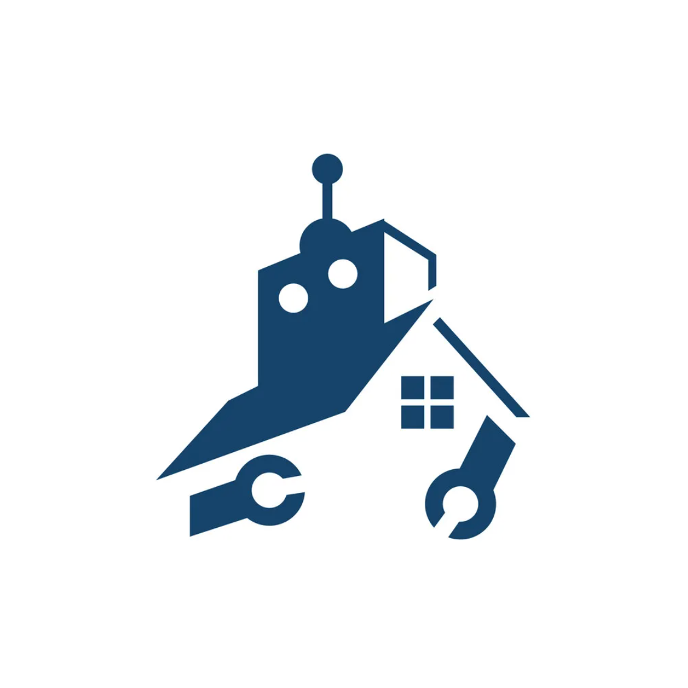

<div id="top"></div>
<!--
*** Thanks for checking out the Best-README-Template. If you have a suggestion
*** that would make this better, please fork the repo and create a pull request
*** or simply open an issue with the tag "enhancement".
*** Don't forget to give the project a star!
*** Thanks again! Now go create something AMAZING! :D
-->

<!-- PROJECT SHIELDS -->
<!--
*** I'm using markdown "reference style" links for readability.
*** Reference links are enclosed in brackets [ ] instead of parentheses ( ).
*** See the bottom of this document for the declaration of the reference variables
*** for contributors-url, forks-url, etc. This is an optional, concise syntax you may use.
*** https://www.markdownguide.org/basic-syntax/#reference-style-links
-->

[![Contributors][contributors-shield]][contributors-url]
[![Forks][forks-shield]][forks-url]
[![Stargazers][stars-shield]][stars-url]
[![Issues][issues-shield]][issues-url]
[![MIT License][license-shield]][license-url]
[![LinkedIn][linkedin-shield]][linkedin-url]

<!-- PROJECT LOGO -->
<br />
<div align="center">
  <a href="https://github.com/anthonysgro/RoboHouse">
    
  </a>

  <h3 align="center">RoboHouse</h3>

  <p align="center">
    A side-project to get an apartment quicker than everybody else...
    <br />
    <br />
    <a href="https://github.com/anthonysgro/RoboHouse">View Demo</a>
    ·
    <a href="https://github.com/anthonysgro/RoboHouse/issues">Report Bug</a>
    ·
    <a href="https://github.com/anthonysgro/RoboHouse/issues">Request Feature</a>
  </p>
</div>

<!-- TABLE OF CONTENTS -->
<details>
  <summary>Table of Contents</summary>
  <ol>
    <li>
      <a href="#about-the-project">About The Project</a>
      <ul>
        <li><a href="#built-with">Built With</a></li>
      </ul>
    </li>
    <li>
      <a href="#getting-started">Getting Started</a>
      <ul>
        <li><a href="#prerequisites">Prerequisites</a></li>
        <li><a href="#installation">Installation</a></li>
      </ul>
    </li>
    <li><a href="#usage">Usage</a></li>
    <li><a href="#roadmap">Roadmap</a></li>
    <li><a href="#contributing">Contributing</a></li>
    <li><a href="#license">License</a></li>
    <li><a href="#contact">Contact</a></li>
  </ol>
</details>

<!-- ABOUT THE PROJECT -->

## About The Project

[![Product Name Screen Shot][product-screenshot]](https://example.com)
Apartment hunting is a huge hassle, especially in New York City. I felt so defeated seeing a listing that had been up for two days that was already in-contract, or that had already received a daunting amount of applications.

I searched far and wide for a good way to automate the apartment hunting process, but it seemed impossible. Many sites had ways to identify scripting and bots. The many others that didn't had lacklust listings. Thus I bring you, RoboHouse.

Here's why it's cool:

-   You should be able to know about apartments as soon as they are posted. Why miss out when even waiting 3 hours could cost you your dream apartment?
-   You shouldn't have to rely on Streeteasy's built-in notification system, which plainly does not work for me, even when set to "Instant".
-   You shouldn't have to accept that botting is impossible on many real estate sites. Where there's a will, there's a way!

I will be adding more in the near future. You may also suggest changes by forking this repo and creating a pull request or opening an issue. Thanks!

<p align="right">(<a href="#top">back to top</a>)</p>

### Built With

Major Frameworks/Libraries:

-   [Node.js](https://nodejs.org/en/)
-   [Express](https://expressjs.com/)
-   [React](https://reactjs.org/)
-   [PostgreSQL](https://www.postgresql.org/)
-   [Sequelize](https://sequelize.org/)
-   [Webpack](https://webpack.js.org/)

API Integrations:

-   [ScraperAPI](https://www.scraperapi.com/)
-   [Twilio](https://www.twilio.com/)
-   [Slack](https://www.slack.com/)

Minor Libraries:

-   [Puppeteer](https://pptr.dev/)
-   [Cheerio](https://www.npmjs.com/package/cheerio)

<p align="right">(<a href="#top">back to top</a>)</p>

<!-- GETTING STARTED -->

## Getting Started

Here are some instructions to get your project set up locally:

### Prerequisites

First, make sure you have the latest version of node and npm.

-   npm

    ```sh
    npm install npm@latest -g
    ```

-   postgres: Create a database titled "RoboHouse" through your preferred postgres client (psql, postico, datagrip, etc.)

### Installation

1.  Clone the repo

    ```sh
    git clone https://github.com/anthonysgro/RoboHouse.git
    ```

2.  Add `.gitignore` file if you want:

    ```yml
    node_modules
    .env
    .gitignore
    dist
    ```

3.  Add two properties to `.env`. Use "dev" for your local copy, and "prod" for whenever you deploy to your preferred host provider. APP_FREQUENCY_MINUTES can be set to anything, but I recommend between 20-45 minutes. The free tier of ScraperAPI (next step) gives you 1000 proxy rotations a month, which will be enough for about 1 API call per 45 minutes. The first week gives you 5000, so you should be good enough to use any value between 20-45 for the duration of your apartment search.

    ```yml
    APP_ENV=dev
    APP_FREQUENCY_MINUTES=
    ```

4.  Get a free API Key at [https://scraperapi.com/](https://scraperapi.com/) and add the following properties to `.env`:

    ```yml
    PROXY_USERNAME=
    PROXY_PASSWORD=
    PROXY_SERVER=proxy-server.scraperapi.com
    PROXY_SERVER_PORT=8001
    ```

5.  There are two notification systems: Slack and Text. Skip to Step 6 if you prefer text. For Slack notifications, follow the instructions here and create your own workspace and web app: [video](https://www.youtube.com/watch?v=nyaCol4IH5c). Add the following properties to `.env`:

    ```yml
    SLACK_NOTIFICATIONS_ENABLED=true
    SLACK_APP_WEBHOOK_URL_DEV=
    SLACK_APP_WEBHOOK_URL_PROD=
    ```

    Create two channels to take advantage of different dev environments. Otherwise, just use the same webhook for both.

6.  For text notifications, create a free account at [twilio](https://www.twilio.com/), add your number under Verified Caller ID's (and any other subscriber numbers), and add the following properties to .env:

    ```yml
    TEXT_NOTIFICATIONS_ENABLED=true
    TWILIO_ACCOUNT_DEV_PHONE_NUMBERS=+10987654321,+11234567890  #comma delineated list
    TWILIO_ACCOUNT_PROD_PHONE_NUMBERS=+10987654321 #for just one, omit comma
    TWILIO_ACCOUNT_SOURCE_PHONE_NUMBER=           #input default Twilio number
    TWILIO_ACCOUNT_SID=
    TWILIO_ACCOUNT_TOKEN=
    ```

7.  You must indicate your Streeteasy and Corcoran search strings. You can obtain this by navigating to the Streeteasy or Corcoran site and entering your search parameters and going to the search page. You can then obtain your request URL by copy/pasting the search bar and pasting it here. Examples:

    ```yml
    STREETEASY_URL=https://streeteasy.com/pet-friendly-rentals/nyc/price:-3000%7Carea:139,135%7Cbeds%3E=1%7Cno_fee:1

    # This example url searches for no-fee, pet-friendly 1+ bed apts under $3000/mo in either the UWS or UES.

    CORCORAN_URL=https://www.corcoran.com/homes-for-rent/location/upper-west-side-ny-7662%2Cupper-east-side-ny-7661/regionId=1?priceMax=3000&bedMin=1&features=pet-friendly&sortBy=listedDate%2Bdesc

    # The same query for corcoran (minus no-fee). Important to note, Streeteasy defaults to showing the apartments by "Newest" so you do not need to explicitly include that in the url. This is not the case with Corcoran, so you must append "&sortBy=listedDate%2Bdesc" to your GET request url. If you don't, you may not get the newest apartments correctly.
    ```

    Note: Only Streeteasy and Corcoran are supported currently. Let me know if you would like to see other sites supported!

8.  Install NPM packages

    ```sh
    npm install
    ```

9.  Run `npm run start:dev` to run locally for dev environment

10. Deploy to your preferred hosting site. I used [heroku](https://dashboard.heroku.com/). Ensure that you add all environment variables to heroku config, changing `APP_ENV=prod`. You will also have to add the [Heroku Postgres Add-On](https://elements.heroku.com/addons/heroku-postgresql), and add the [puppeteer buildpack](https://github.com/jontewks/puppeteer-heroku-buildpack.git) to the project. I also had to pay to use the first tier of dynos ($7/mo) to make sure the app didn't go to sleep.

<p align="right">(<a href="#top">back to top</a>)</p>

<!-- USAGE EXAMPLES -->

## Usage

Once the app successfully deploys, it should start up automatically! You may get an initial set of texts/slack messages as all of the apartments found will be new. Use that as confirmation the app works and you set it up correctly.

If for some reason the app hits a snag, you should be able to load the webpage which shows the status. Confirm that it is not running either through the logs or the big red X in the frontend. I included a reset button so that you can quickly restart the scraping since sometimes transient failures occur because of the networking nature of this application.

Feel free to reach out if you have additional questions. There is some basic logging throughout the app that you can use to follow the flow of the application.

<p align="right">(<a href="#top">back to top</a>)</p>

<!-- ROADMAP -->

## Roadmap

-   [x] Add basic scraping for one site
-   [x] Add continuous scraping with heartbeat
-   [x] Add database to tell if new listing appears
-   [x] Deploy live
-   [x] Handle Slack notifications
-   [x] Handle SMS notifications
-   [ ] Handle custom queries outside of env variables
-   [ ] Automatically message the agent (this would be amazing, but sadly very difficult for Streeteasy)
-   [ ] Integration with your Streeteasy account
-   [ ] Add additional real estate site integrations
-   [ ] Switch to Typescript

See the [open issues](https://github.com/anthonysgro/RoboHouse/issues) for a full list of proposed features (and known issues).

<p align="right">(<a href="#top">back to top</a>)</p>

<!-- CONTRIBUTING -->

## Contributing

Contributions are what make the open source community such an amazing place to learn, inspire, and create. Any contributions you make are **greatly appreciated**.

If you have a suggestion that would make this better, please fork the repo and create a pull request. You can also simply open an issue with the tag "enhancement".
Don't forget to give the project a star! Thanks again!

1. Fork the Project
2. Create your Feature Branch (`git checkout -b feature/AmazingFeature`)
3. Commit your Changes (`git commit -m 'Add some AmazingFeature'`)
4. Push to the Branch (`git push origin feature/AmazingFeature`)
5. Open a Pull Request

<p align="right">(<a href="#top">back to top</a>)</p>

<!-- LICENSE -->

## License

Distributed under the MIT License. See `LICENSE.txt` for more information.

<p align="right">(<a href="#top">back to top</a>)</p>

<!-- CONTACT -->

## Contact

Anthony Sgro - [@yaboysgro](https://twitter.com/yaboysgro)

Project Link: [https://github.com/anthonysgro/RoboHouse](https://github.com/anthonysgro/RoboHouse)

<p align="right">(<a href="#top">back to top</a>)</p>

<!-- MARKDOWN LINKS & IMAGES -->
<!-- https://www.markdownguide.org/basic-syntax/#reference-style-links -->

[contributors-shield]: https://img.shields.io/github/contributors/anthonysgro/RoboHouse.svg?style=for-the-badge
[contributors-url]: https://github.com/anthonysgro/RoboHouse/graphs/contributors
[forks-shield]: https://img.shields.io/github/forks/anthonysgro/RoboHouse.svg?style=for-the-badge
[forks-url]: https://github.com/anthonysgro/RoboHouse/network/members
[stars-shield]: https://img.shields.io/github/stars/anthonysgro/RoboHouse.svg?style=for-the-badge
[stars-url]: https://github.com/anthonysgro/RoboHouse/stargazers
[issues-shield]: https://img.shields.io/github/issues/anthonysgro/RoboHouse.svg?style=for-the-badge
[issues-url]: https://github.com/anthonysgro/RoboHouse/issues
[license-shield]: https://img.shields.io/github/license/anthonysgro/RoboHouse.svg?style=for-the-badge
[license-url]: https://github.com/anthonysgro/RoboHouse/blob/main/LICENSE.txt
[linkedin-shield]: https://img.shields.io/badge/-LinkedIn-black.svg?style=for-the-badge&logo=linkedin&colorB=555
[linkedin-url]: https://linkedin.com/in/sgro
[product-screenshot]: public/assets/screenshot.png
